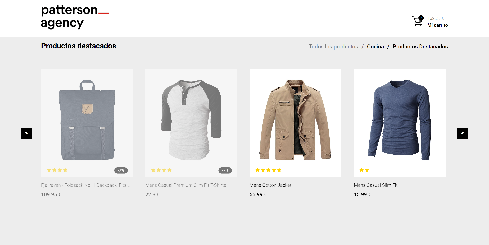

# Ecommerce simple challenge

## 🚀 Demo

See demo [here](https://patterson-agency-store.vercel.app/)

## 📚 Stack

- Webpack (custom config)
- React
- Typescript
- Redux
- Redux Persist
- Sass
- Jest

## 👩‍💻 Project explanation

Basic online store with simple shopping cart.

### Home

- Header simple con logo y carrito. El carro solo es un link a la siguiente página, no hay que darle
animación alguna.
- Añadir 4 productos a la web, obtenidos de una llamada a una API. Se deberá crear el conector de
la API y consumir este endpoint:
- <https://fakestoreapi.com/products?limit=4>
- El precio, título e identificador se obtendrán de dicha llamada (price, id, title), el número de
estrellas puede ponerse fijo o aleatorio.
- La lógica en JS consiste en la gestión de los artículos y el carrito.
- Opcional: crear slider con desplazamiento infinito para mostrar los productos.
- Opcional: Hover en el artículo: aparece el botón para añadir al carro (animación libre). No es
obligatorio, se puede añadir dicho botón sobre el artículo sin hover.
- Los breadcrumbs no realizan ninguna función.

### Carrito

- Para simplificar, solo se puede añadir un artículo de cada tipo (es decir, como si solo tuviéramos
una unidad de stock por artículo). A medida que se añaden artículos se modifica el precio. Hay un
botón para eliminarlos.
- Opcional: Se pueden aplicar los siguientes códigos de descuento: **DTO10**, **DTO50** y debe
gestionarse su funcionamiento y persistencia. No son acumulables.
- No hay que realizar más funcionalidades, finalizar compra está inactivo.
